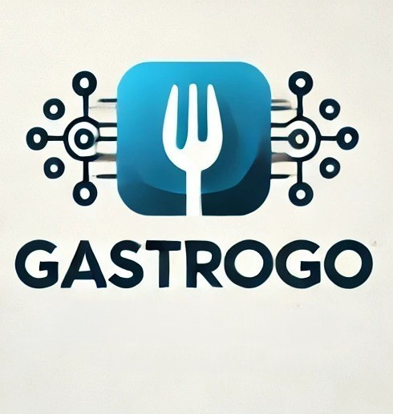

  
  
  
Universidad Peruana de Ciencias Aplicadas  
  
Carrera: Ingeniería de Software  
  
Ciclo: 2024-02  
  
Curso: Aplicaciones Web

Sección: WX53 
  
Profesor: Alberto Wilmer Sánchez Seña
  
Informe del Trabajo Final  
  
Startup: DevDynasty
  
Producto: GastroGo

Integrantes:
- 

  
**Agosto del 2024**

  
---  
# Registro de Versiones del Informe  
  
  
---  
# Project Report Collaboration Insights  
  
  
---  
# Student Outcome  
El curso contribuye al cumplimiento del Student Outcome ABET: **ABET – EAC - Student Outcome 3**   Criterio: *Capacidad de comunicarse efectivamente con un rango de audiencias.*  
  
En el siguiente cuadro se describe las acciones realizadas y enunciados de conclusiones por parte del grupo, que permiten sustentar el haber alcanzado el logro del ABET – EAC - Student Outcome 3.  
  
| Criterio específico                                                                                                                                                                | Acciones realizadas                                                                                                                                                                                                                                                                                                                                                                                                                                                                                                                                                                                                                                                                                                                                                                                                                                                                                                                                                                                                                                                                                                                                           | Conclusiones                                                                                                                                                                                                                                                                                                                                                                         |  
|------------------------------------------------------------------------------------------------------------------------------------------------------------------------------------|---------------------------------------------------------------------------------------------------------------------------------------------------------------------------------------------------------------------------------------------------------------------------------------------------------------------------------------------------------------------------------------------------------------------------------------------------------------------------------------------------------------------------------------------------------------------------------------------------------------------------------------------------------------------------------------------------------------------------------------------------------------------------------------------------------------------------------------------------------------------------------------------------------------------------------------------------------------------------------------------------------------------------------------------------------------------------------------------------------------------------------------------------------------|--------------------------------------------------------------------------------------------------------------------------------------------------------------------------------------------------------------------------------------------------------------------------------------------------------------------------------------------------------------------------------------|  
| Comunica oralmente sus ideas y/o resultados con objetividad a público de diferentes especialidades y niveles jerarquicos, en el marco del desarrollo de un proyecto en ingeniería. | **Apellido Apellido Nombre Nombre**   ***TB1:*** Morbi vel tortor id eros dictum venenatis id ut dui.Mauris quis tellus sed nunc hendrerit vehicula ac id mauris.   ***TP:*** Morbi vel tortor id eros dictum venenatis id ut dui.Mauris quis tellus sed nunc hendrerit vehicula ac id mauris.   ***TB2:*** Morbi vel tortor id eros dictum venenatis id ut dui.Mauris quis tellus sed nunc hendrerit vehicula ac id mauris.   ***TF:*** Morbi vel tortor id eros dictum venenatis id ut dui.Mauris quis tellus sed nunc hendrerit vehicula ac id mauris.    **Apellido Apellido Nombre Nombre**   ***TB1:*** Morbi vel tortor id eros dictum venenatis id ut dui.Mauris quis tellus sed nunc hendrerit vehicula ac id mauris.   ***TP:*** Morbi vel tortor id eros dictum venenatis id ut dui.Mauris quis tellus sed nunc hendrerit vehicula ac id mauris.   ***TB2:*** Morbi vel tortor id eros dictum venenatis id ut dui.Mauris quis tellus sed nunc hendrerit vehicula ac id mauris.   ***TF:*** Morbi vel tortor id eros dictum venenatis id ut dui.Mauris quis tellus sed nunc hendrerit vehicula ac id mauris.    | ***TB1:*** Fusce cursus dolor et nulla suscipit, sit amet ullamcorper nibh vestibulum.    ***TP:*** Fusce cursus dolor et nulla suscipit, sit amet ullamcorper nibh vestibulum.    ***TB2:*** Fusce cursus dolor et nulla suscipit, sit amet ullamcorper nibh vestibulum.    ***TF:*** Fusce cursus dolor et nulla suscipit, sit amet ullamcorper nibh vestibulum. | | Comunica en forma escrita ideas y/o resultados con objetividad a público de diferentes especialidades y niveles jerarquicos, en el marco del desarrollo de un proyecto en ingeniería. | ***Apellido Apellido Nombre Nombre***   ***TB1:*** Cras sed diam suscipit, malesuada ex rutrum, fringilla orci. Vestibulum in nunc quis elit suscipit sollicitudin.   ***TP:*** Cras sed diam suscipit, malesuada ex rutrum, fringilla orci. Vestibulum in nunc quis elit suscipit sollicitudin.   ***TB2:*** Cras sed diam suscipit, malesuada ex rutrum, fringilla orci. Vestibulum in nunc quis elit suscipit sollicitudin.   ***TF:*** Cras sed diam suscipit, malesuada ex rutrum, fringilla orci. Vestibulum in nunc quis elit suscipit sollicitudin.    ***Apellido Apellido Nombre Nombre***   ***TB1:*** Cras sed diam suscipit, malesuada ex rutrum, fringilla orci. Vestibulum in nunc quis elit suscipit sollicitudin.   ***TP:*** Cras sed diam suscipit, malesuada ex rutrum, fringilla orci. Vestibulum in nunc quis elit suscipit sollicitudin.   ***TB2:*** Cras sed diam suscipit, malesuada ex rutrum, fringilla orci. Vestibulum in nunc quis elit suscipit sollicitudin.   ***TF:*** Cras sed diam suscipit, malesuada ex rutrum, fringilla orci. Vestibulum in nunc quis elit suscipit sollicitudin. | ***TB1:*** FEtiam imperdiet quam condimentum velit tempor porttitor.    ***TP:*** FEtiam imperdiet quam condimentum velit tempor porttitor.    ***TB2:*** FEtiam imperdiet quam condimentum velit tempor porttitor.    ***TF:*** FEtiam imperdiet quam condimentum velit tempor porttitor. |  
  
---  
# Contenido  
## Tabla de contenidos  
  
### [Capítulo I: Introducción]()  
- [1.1. Startup Profile]()  
  - [1.1.1 Descripción de la Startup]()  
  - [1.1.2 Perfiles de integrantes del equipo]()  
- [1.2 Solution Profile]()  
  - [1.2.1 Antecedentes y problemática]()  
  - [1.2.2 Lean UX Process]()  
      - [1.2.2.1. Lean UX Problem Statements]()  
      - [1.2.2.2. Lean UX Assumptions]()  
      - [1.2.2.3. Lean UX Hypothesis Statements]()  
      - [1.2.2.4. Lean UX Canvas]()  
- [1.3. Segmentos objetivo]()  
  
### [Capítulo II: Requirements Elicitation & Analysis]()  
- [2.1. Competidores]()  
  - [2.1.1. Análisis competitivo]()  
  - [2.1.2. Estrategias y tácticas frente a competidores]()  
- [2.2. Entrevistas]()  
  - [2.2.1. Diseño de entrevistas]()  
  - [2.2.2. Registro de entrevistas]()  
  - [2.2.3. Análisis de entrevistas]()  
- [2.3. Needfinding]()  
  - [2.3.1. User Personas]()  
  - [2.3.2. User Task Matrix]()  
  - [2.3.3. User Journey Mapping]()  
  - [2.3.4. Empathy Mapping]()  
  - [2.3.5. As-is Scenario Mapping]()  
- [2.4. Ubiquitous Language]()  
  
### [Capítulo III: Requirements Specification]()  
- [3.1. To-Be Scenario Mapping]()  
- [3.2. User Stories]()  
- [3.3. Impact Mapping]()  
- [3.4. Product Backlog]()  
  
  
### [Capítulo IV: Product Design]()  
- [4.1. Style Guidelines]()  
  - [4.1.1. General Style Guidelines]()  
  - [4.1.2. Web Style Guidelines]()  
- [4.2. Information Architecture]()  
  - [4.2.1. Organization Systems]()  
  - [4.2.2. Labeling Systems]()  
  - [4.2.3. SEO Tags and Meta Tags]()  
  - [4.2.4. Searching Systems]()  
  - [4.2.5. Navigation Systems]()  
- [4.3. Landing Page UI Design]()  
  - [4.3.1. Landing Page Wireframe]()  
  - [4.3.2. Landing Page Mock-up]()  
- [4.4. Web Applications UX/UI Design]()  
  - [4.4.1. Web Applications Wireframes]()  
  - [4.4.2. Web Applications Wireflow Diagrams]()  
  - [4.4.3. Web Applications Mock-ups]()  
  - [4.4.4. Web Applications User Flow Diagrams]()  
- [4.5. Web Applications Prototyping]()  
- [4.6. Domain-Driven Software Architecture]()  
  - [4.6.1. Software Architecture Context Diagram]()  
  - [4.6.2. Software Architecture Container Diagrams]()  
  - [4.6.3. Software Architecture Components Diagrams]()  
- [4.7. Software Object-Oriented Design]()  
  - [4.7.1. Class Diagrams]()  
  - [4.7.2. Class Dictionary]()  
- [4.8. Database Design]()  
  - [4.8.1. Database Diagram]()  
  
  
### [Capítulo V: Product Implementation, Validation & Deployment]()  
- [5.1. Software Configuration Management]()  
  - [5.1.1. Software Development Environment Configuration]()  
  - [5.1.2. Source Code Management]()  
  - [5.1.3. Source Code Style Guide & Conventions]()  
  - [5.1.4. Software Deployment Configuration]()  
- [5.2. Landing Page, Services & Applications Implementation]()  
  - [5.2.1. Sprint 1]()  
      - [5.2.1.1. Sprint Planning 1]()  
      - [5.2.1.2. Sprint Backlog 1]()  
      - [5.2.1.3. Development Evidence for Sprint Review]()  
      - [5.2.1.4. Testing Suite Evidence for Sprint Review]()  
      - [5.2.1.5. Execution Evidence for Sprint Review]()  
      - [5.2.1.6. Services Documentation Evidence for Sprint Review]()  
      - [5.2.1.7. Software Deployment Evidence for Sprint Review]()  
      - [5.2.1.8. Team Collaboration Insights during Sprint]()  
  - [5.2.2. Sprint 2]()  
      - [5.2.2.1. Sprint Planning 2]()  
      - [5.2.2.2. Sprint Backlog 2]()  
      - [5.2.2.3. Development Evidence for Sprint Review]()  
      - [5.2.2.4. Testing Suite Evidence for Sprint Review]()  
      - [5.2.2.5. Execution Evidence for Sprint Review]()  
      - [5.2.2.6. Services Documentation Evidence for Sprint Review]()  
      - [5.2.2.7. Software Deployment Evidence for Sprint Review]()  
      - [5.2.2.8. Team Collaboration Insights during Sprint]()  
  - [5.2.3. Sprint 3]()  
      - [5.2.3.1. Sprint Planning 3]()  
      - [5.2.3.2. Sprint Backlog 3]()  
      - [5.2.3.3. Development Evidence for Sprint Review]()  
      - [5.2.3.4. Testing Suite Evidence for Sprint Review]()  
      - [5.2.3.5. Execution Evidence for Sprint Review]()  
      - [5.2.3.6. Services Documentation Evidence for Sprint Review]()  
      - [5.2.3.7. Software Deployment Evidence for Sprint Review]()  
      - [5.2.3.8. Team Collaboration Insights during Sprint]()  
  - [5.2.4. Sprint 4]()  
      - [5.2.4.1. Sprint Planning 4]()  
      - [5.2.4.2. Sprint Backlog 4]()  
      - [5.2.4.3. Development Evidence for Sprint Review]()  
      - [5.2.4.4. Testing Suite Evidence for Sprint Review]()  
      - [5.2.4.5. Execution Evidence for Sprint Review]()  
      - [5.2.4.6. Services Documentation Evidence for Sprint Review]()  
      - [5.2.4.7. Software Deployment Evidence for Sprint Review]()  
      - [5.2.4.8. Team Collaboration Insights during Sprint]()  
- [5.3. Validation Interviews]()  
  - [5.3.1. Diseño de Entrevistas]()  
  - [5.3.2. Registro de Entrevistas]()  
  - [5.3.3. Evaluaciones según heurísticas]()  
- [5.4. Video About-the-Product]()  
  
---  
# Capítulo I: Introducción  
## 1.1. Startup Profile  
### 1.1.1 Descripción de la Startup  
### 1.1.2 Perfiles de integrantes del equipo  
## 1.2 Solution Profile  
### 1.2.1 Antecedentes y problemática  
### 1.2.2 Lean UX Process  
#### 1.2.2.1. Lean UX Problem Statements  
#### 1.2.2.2. Lean UX Assumptions  
#### 1.2.2.3. Lean UX Hypothesis Statements  
#### 1.2.2.4. Lean UX Canvas  
## 1.3. Segmentos objetivo  
# Capítulo II: Requirements Elicitation & Analysis  
## 2.1 Competidores  
## 2.2. Entrevistas  
### 2.2.1. Diseño de entrevistas  
### 2.2.2. Registro de entrevistas  
### 2.2.3. Análisis de entrevistas  
## 2.3. Needfinding  
### 2.3.1. User Personas  
### 2.3.2. User Task Matrix  
### 2.3.3. User Journey Mapping  
### 2.3.4. Empathy Mapping  
### 2.3.5. As-is Scenario Mapping  
## 2.4. Ubiquitous Language  
# Capítulo III: Requirements Specification  
## 3.1. To-Be Scenario Mapping  
## 3.2. User Stories  
## 3.3. Impact Mapping  
## 3.4. Product Backlog  
# Capítulo IV: Product Design  
# Capítulo IV: Product Design

Este capítulo se plantea en el proceso de diseño de los productos digitales que brinda DevDynasty. Asimismo, se enfocará en el diseño visual y la arquitectura de la información con la que se alinearán los productos para crear interfaces de usuario (UI) y experiencias de usuario (UX) efectivas.
## 4.1. Style Guidelines.

En este segmento, se detallarán las guías de estilo específicas para la landing page y aplicación web. Esto será esencial para mantener coherencia en la apariencia visual de los elementos presentes en nuestros productos.
### 4.1.1. General Style Guidelines.

**Branding**:

*Brand Overview*
GastroGo es una plataforma diseñada para simplificar el procedo de pedidos de almuerzos (comúnmente conocido como menús) para distintos grupos de trabajadores dentro de empresas. Nuestro objetivo es ofrecer al usuario una experiencia fluida para los restaurantes asociados y a los empleados de distintas empresas de la capital. Nos aseguramos que de los empleados puedan obtener un almuerzo de su agrado y facilidad al momento de pedir y recibir. Asimismo, nos enfocamos en brindar a los restaurantes la oportunidad de expandir su clientela en el rubro.

*Brand Name*
GastroGo utiliza "Gastro" (abreviatura de la palabra gastronomía) y "Go" (ir en la traducción al español) para transmitir la idea de la aplicación de manera rápida. Tener la abreviación de gastronomía indica, inmediatamente, que la aplicación está enfocada en alimentos. Asimismo, se tiene en cuenta el "go" porque esta palabra suele estar relacionada con movilidad y rapidez. Es por ello que el nombre es fácil de entender desde la perspectiva del usuario, sabrá instantáneamente que el producto es sobre pedidos de comida. Al ser un nombre llamativo, permitirá que captemos la atención de un amplio número de usuarios interesados en encontrar una solución rápida de comida.

A continuación, se mostrará el logo:

Se utilizó el nombre completo de la aplicación debido a que es corta y fácil de recordar. También, el uso de un tenedor como imagen central representa los pedidos de comida que se pueden realizar. Incluimos unas líneas que parten del punto central a distintos círculos, esto representa que la conexión que permite GastroGo, de los restaurantes a varios grupos de empleados con la necesidad de recibir su comida para la hora del almuerzo.

**Typography:**

Se utilizó la fuente Roboto debido a su facilidad al momento de leer. Roboto es una fuente bastante utilizada en la mayoría de aplicaciones debido a la legibilidad que presenta. Para utilizarla, tuvimos en cuento el tamaño de letra para los cuatro niveles necesarios para nuestros productos que son los encabezados, cuerpo de texto, botones y enlaces.

  

*Typescale recuperado de: https://m2.material.io/design/typography/the-type-system.html*

**Colors:**

Para poder escoger los colores representativos de la aplicación, decidimos basarnos en los efectos que puede producir en los usuarios al momento de verlo. En este caso, se utilizaron los colores azul y naranja, de ahí partimos para crear la paleta de colores. La razón para escoger el azul es porque representa seguridad y es bastante popular en varias aplicaciones reconocidas. Además, es un color calmado, permite que el usuario se sienta cómodo al momento de navegar. Asimismo, decidimos agregar el color naranja como color secundario debido a la calidez que emite al usuario. La razón por la cuál se escogió el naranja es porque es más llamativo, por ello es que preferimos colocarlo en los call to action. Enlace a la paleta: https://www.figma.com/design/HGjzWSvewN97ZBYXu5FkdL/ApplicationWeb?node-id=0-1&t=9bAg56CXCBc09MeI-1

  

*Color Palette recuperado de: https://material.io/design/color/the-color-system.html#color-theme-creation*

  

## 4.2. Information Architecture  
## 4.3. Landing Page UI Design  
## 4.4. Web Applications UX/UI Design  
### 4.4.1. Web Applications Wireframes  
### 4.4.2. Web Applications Wireflow Diagrams  
### 4.4.3. Web Applications Mock-ups  
### 4.4.4. Web Applications User Flow Diagrams  
## 4.5. Web Applications Prototyping  
## 4.6. Domain-Driven Software Architecture  
### 4.6.1. Software Architecture Context Diagram  
### 4.6.2. Software Architecture Container Diagrams  
### 4.6.3. Software Architecture Components Diagrams  
## 4.7. Software Object-Oriented Design  
### 4.7.1. Class Diagrams  
### 4.7.2. Class Dictionary  
## 4.8. Database Design  
### 4.8.1. Database Diagram  
# Capítulo V: Product Implementation, Validation & Deployment  
## 5.1. Software Configuration Management  
### 5.1.1. Software Development Environment Configuration  
  
### 5.1.2. Source Code Management  
  
### 5.1.3. Source Code Style Guide & Conventions  
  
### 5.1.4. Software Deployment Configuration  
  
## 5.2. Landing Page, Services & Applications Implementation  
### 5.2.1. Sprint 1  
#### 5.2.1.1. Sprint Planning 1  
  
#### 5.2.1.2. Sprint Backlog 1  
  
#### 5.2.1.3. Development Evidence for Sprint Review  
  
#### 5.2.1.4. Testing Suite Evidence for Sprint Review  
  
#### 5.2.1.5. Execution Evidence for Sprint Review  
  
#### 5.2.1.6. Services Documentation Evidence for Sprint Review  
  
#### 5.2.1.7. Software Deployment Evidence for Sprint Review  
  
#### 5.2.1.8. Team Collaboration Insights during Sprint  
  
# Conclusiones  
### Conclusiones y recomendaciones  
### Video About-the-Team  
  
---  
# Bibliografía  
  
---  
# Anexos
